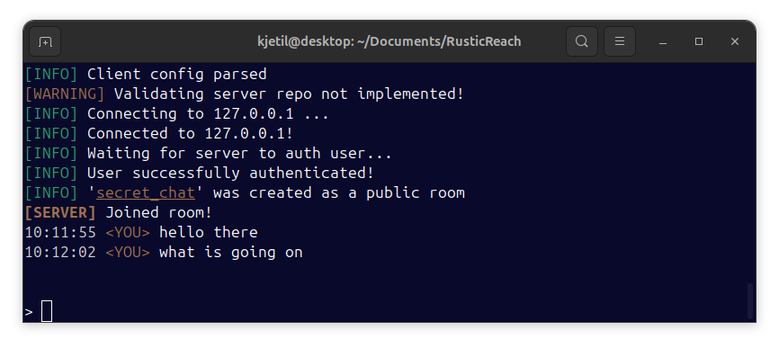
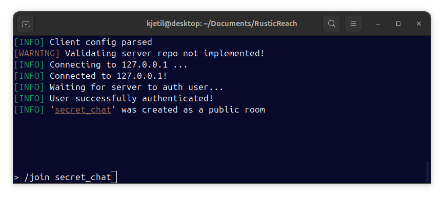

# RusticReach 🦀

<div align="center">
  
  
</div>

RusticReach is a self-hosted chat service that in total control of the admin and its users. It enables you to run your own private chat server with extensive customization options. Server administrators have full control over user management, room configurations, and security policies. The YAML-based configuration system allows for easy tweaking of every aspect - from setting welcome messages to defining strict access controls and room limitations.

*Repository created for educational purposes only. The code is a work in progress. Feel free to [contribute!](CONTRIBUTING.md)*

## Usage

### Client Configuration

Create a client configuration file (`client.yml`):

```yml
client:
  user_token: "12345678756432134567"
  user_name: "zebra123"
  hash_pass: "asfdgfhgdQESHZDJXK"
  validate_server_repo: true
  default_server:
    server_ip: 127.0.0.1
    auto_connect: true
  room_aliases:
    friends: "elephant321"
    work: "anon"
    hacker_arena: "test"
```

### Server Config

```yml
server:
  # Server host info
  admin:
    name: "admin"
    token: "123dfgfaerw47ur6d"  # Used for admin authentication
    password_hash: "awtsy5e4ha"  # Hashed admin password for authentication
  
  # General server information
  general:
    server_name: "MyChatServer"
    description: "A secure chat server for friends and colleagues."
    server_version: "1.0.0"
    welcome_message: "Welcome to MyChatServer!"  # Message shown to users when they connect
    max_user_count: 1000  # Max number of users allowed to connect at once
    server_uptime: 72  # Server uptime in hours
  
  # Room Configuration
  room_config:
    room_password_required: true  # Whether rooms require a password to join
    max_room_count: 4  # Max number of rooms the server can handle at once
    default_room_type: "public"  # Default room type: "public" or "private"
    room_name_max_length: 50  # Max length for room names
    allow_room_creation: true  # Allow users to create new rooms
    room_capacity: 20  # Max users per room
```

### Running the application

1. Start the server with:

```terminal
cargo run --bin server
```

2. Run the client with:

```terminal
target/bin/client -c <CLIENT_CONFIG.yml>
```

3. Create as many clients as you want